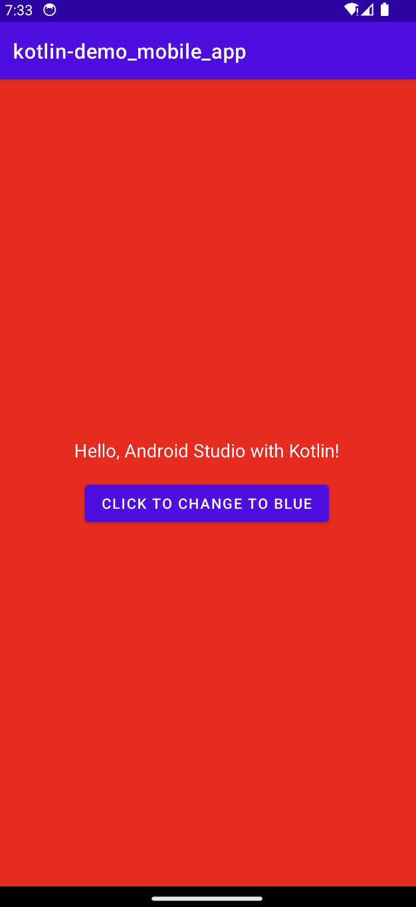

<!-- Begin README -->

    

 

    
    
    
     
    
    
    
     
    

---------------

<h1 align="center">Kotlin Android Mobile App Demo</h1>

A simple mobile app written in Kotlin using Android Studio.
- Click the button to change the background color of the app from **Red** to **Blue**.
- The button text will also change from "Red" to "Blue" and vice versa.

    
     
    <i>It's easy to get started with Kotlin and Android Studio!</i>

---------------

## Table of Contents

- [Getting Started](#getting-started)
- [Resources](#resources)
- [License](#license)
- [Credits](#credits)

## Getting Started

1. Download and install [Android Studio](https://developer.android.com/studio).
2. Clone this repository to your local machine.
3. Open the project in Android Studio.
4. Install the Android Emulator of your choice.
5. Click the `Run` button to run the app in the Android Emulator.

## Resources

- [Android Studio](https://developer.android.com/studio)
- [Android](https://developer.android.com/)
- [Kotlin](https://kotlinlang.org/)
- [Kotlin Documentation](https://kotlinlang.org/docs/home.html)
- [Kotlin Tutorial 1](https://www.tutorialspoint.com/kotlin/index.htm)
- [Kotlin Tutorial 2](https://www.javatpoint.com/kotlin-tutorial)
- [Kotlin Tutorial 3](https://www.w3schools.com/kotlin/index.php)
- [Kotlin Tutorial 4](https://www.geeksforgeeks.org/kotlin-programming-language/)
- [Kotlin Tutorial 5](https://www.programiz.com/kotlin-programming)
- [Kotlin Tutorial 6](https://www.tutorialkart.com/kotlin-tutorial/)

## License

This project is released under the terms of **The Unlicense**, which allows you to use, modify, and distribute the code as you see fit. 
- [The Unlicense](https://choosealicense.com/licenses/unlicense/) removes traditional copyright restrictions, giving you the freedom to use the code in any way you choose.
- For more details, see the [LICENSE](LICENSE) file in this repository.

## Credits

**Author:** [Scott Grivner](https://github.com/scottgriv)  
**Email:** [scott.grivner@gmail.com](mailto:scott.grivner@gmail.com)  
**Website:** [linktr.ee/scottgriv](https://www.linktr.ee/scottgriv)  
**Reference:** [Main Branch](https://github.com/scottgriv/kotlin-android_mobile_app_demo)  

---------------

    

<!-- End README -->
